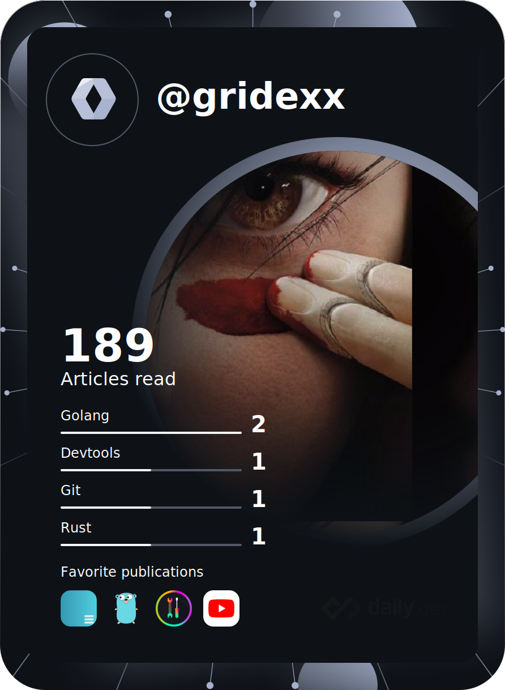

### Hi there 👋

<!--
**GridexX/gridexx** is a ✨ _special_ ✨ repository because its `README.md` (this file) appears on your GitHub profile.

Here are some ideas to get you started:

- 🔭 I’m currently working on ...
- 🌱 I’m currently learning ...
- 👯 I’m looking to collaborate on ...
- 🤔 I’m looking for help with ...
- 💬 Ask me about ...
- 📫 How to reach me: ...
- 😄 Pronouns: ...
- ⚡ Fun fact: ...
-->


<!-- Header -->
<h1 align="center">
  
  <br>
  Hi, I'm Arsène Fougerouse - aka <span style="color:#ffb72e">GridexX</span> 👋
</h1>


<p align="center">
  <b>A creative DevOps Engineer </b>
</p>
<br/>
<p align="center">
  
</p>

- 🎨 Self learner, curious and creative in a nutshell. 
- 🌱 Aware of climate change and positive thinker.
- 📕 I'm currently studying at Polytech Montpellier in **DevOps**
- 👨🏻‍💻 I'm working for [Mezo](https://meso-lr.umontpellier.fr/) as a **DevOps Engineer**


## Here are some of my coding habits ⌨️

<!-- Add a section about tech and Ops stack
  Like this one : https://github.com/Xanthus58#-tech-stack
-->
<!--START_SECTION:waka-->
**I'm an Early 🐤** 

```text
🌞 Morning                710 commits         █████████░░░░░░░░░░░░░░░░   35.36 % 
🌆 Daytime                1030 commits        █████████████░░░░░░░░░░░░   51.29 % 
🌃 Evening                251 commits         ███░░░░░░░░░░░░░░░░░░░░░░   12.50 % 
🌙 Night                  17 commits          ░░░░░░░░░░░░░░░░░░░░░░░░░   00.85 % 
```
📅 **I'm Most Productive on Wednesday** 

```text
Monday                   400 commits         █████░░░░░░░░░░░░░░░░░░░░   19.92 % 
Tuesday                  331 commits         ████░░░░░░░░░░░░░░░░░░░░░   16.48 % 
Wednesday                449 commits         ██████░░░░░░░░░░░░░░░░░░░   22.36 % 
Thursday                 313 commits         ████░░░░░░░░░░░░░░░░░░░░░   15.59 % 
Friday                   286 commits         ████░░░░░░░░░░░░░░░░░░░░░   14.24 % 
Saturday                 131 commits         ██░░░░░░░░░░░░░░░░░░░░░░░   06.52 % 
Sunday                   98 commits          █░░░░░░░░░░░░░░░░░░░░░░░░   04.88 % 
```


📊 **This Week I Spent My Time On** 

```text
💬 Programming Languages: 
JavaScript               8 hrs 43 mins       ████████████░░░░░░░░░░░░░   47.63 % 
Markdown                 4 hrs 23 mins       ██████░░░░░░░░░░░░░░░░░░░   24.01 % 
YAML                     2 hrs 17 mins       ███░░░░░░░░░░░░░░░░░░░░░░   12.55 % 
Python                   1 hr 19 mins        ██░░░░░░░░░░░░░░░░░░░░░░░   07.19 % 
JSON                     42 mins             █░░░░░░░░░░░░░░░░░░░░░░░░   03.87 % 
```


<!--END_SECTION:waka-->

## Here are some of my reading habits 📚
<div  align="center">
  
</div>
